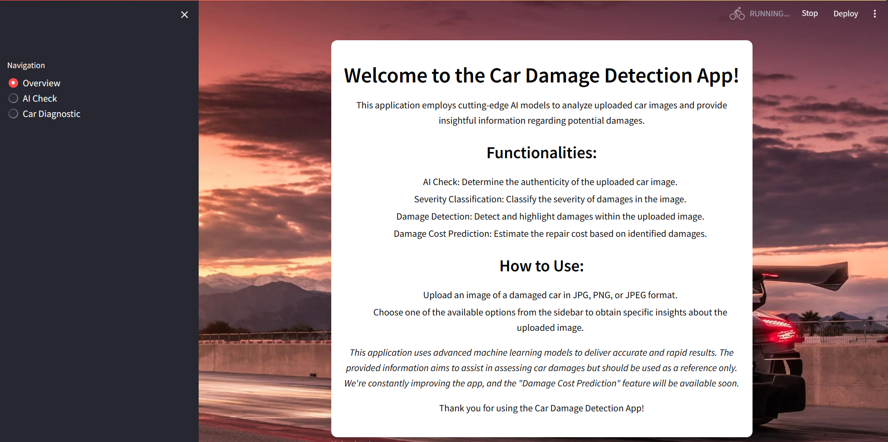
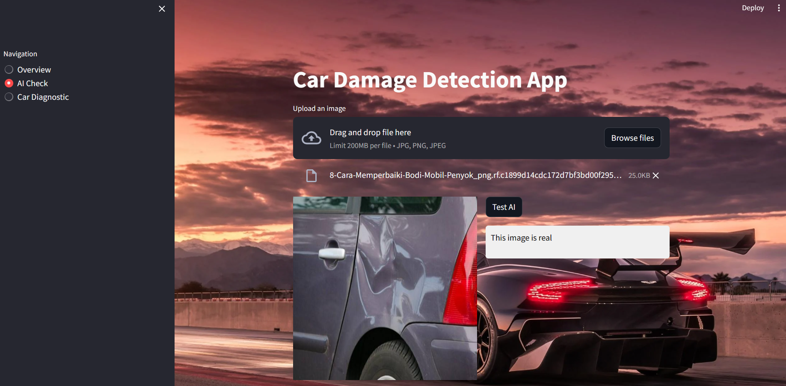
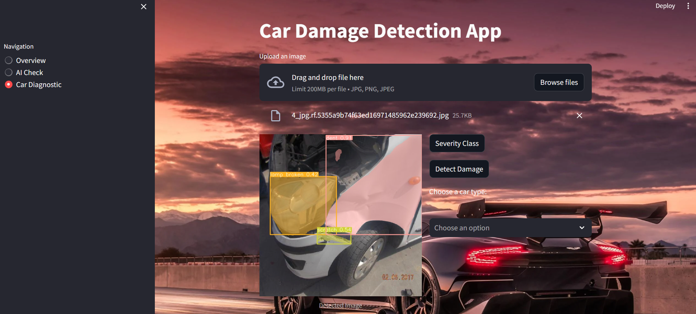
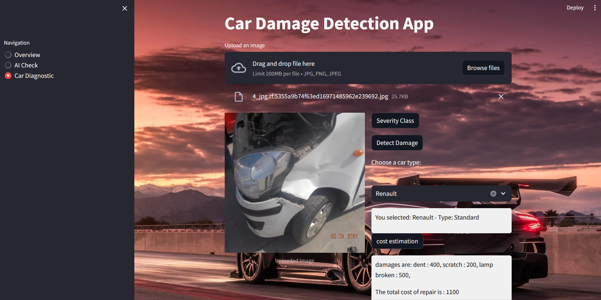

# CarDamageDetection
## Context
This project aims to revolutionize the assessment and analysis of damaged cars through cutting-edge deep learning and computer vision techniques. It encompasses multiple modules, each addressing a crucial aspect of the overall evaluation process. By utilizing this platform, you will be able to detect whether an image of a damaged car is generated by artificial intelligence, ensuring the reliability of the input data. Moving forward, you can classify the severity of car damage into low, medium, or severe categories, providing a comprehensive understanding of the extent of the impairment. The platform also goes a step further by identifying the specific parts of the car that are damaged, contributing to a detailed analysis. Additionally, it takes on the task of segmenting and quantifying the cost of repairing the identified damages, offering valuable insights for repair estimation. The holistic approach of this project aims to advance the field of car damage assessment.

## overview
###  AI Image Detection
An AI detection module is implemented to identify if an image of a damaged car is artificially generated or not. This helps ensure the authenticity of the input data.
 - The module utilizes three distinct models: InceptionV3, a custom-built CNN, and ResNet50.
 - Best performing model: custom-built CNN

###  Damage Severity Assessment
The severity classification module categorizes the detected car damages into three levels: Minor, Moderate, or Severe damage. This provides valuable information for insurance or repair purposes.
 - The module employs three distinct models for this task: VGG16, a custom-built CNN, and ResNet50.
 - Best performing model: Resnet50
### Damage Detection
Detect and highlight damages in the car image using two different algorithms:
 - instance segmentation using Yolov8
 - instance segmentation using MaskRcnn
Best performing model: YOLOV8

### Repair Cost Estimation
Calculate the repair expenses by considering the manually inputted car brand, the severity of detected damage, and the identified damaged parts, utilizing the models from the preceding modules.
 - Two dictionaries have been employed for mapping:
car_types: Maps car brands to their corresponding types, such as Luxury or Standard.
repair_cost_by_type: Maps car types, damage types, and severities to estimated repair costs.

## interface

## Additional Information
For more details on each algorithm, model training, and external dependencies, refer to the specific sections in the source code.
- this is the drive link for trained models: https://drive.google.com/drive/folders/1DVeaUE9Lx4F67DsFJOHiepMIfGv5R-RF?usp=sharing
